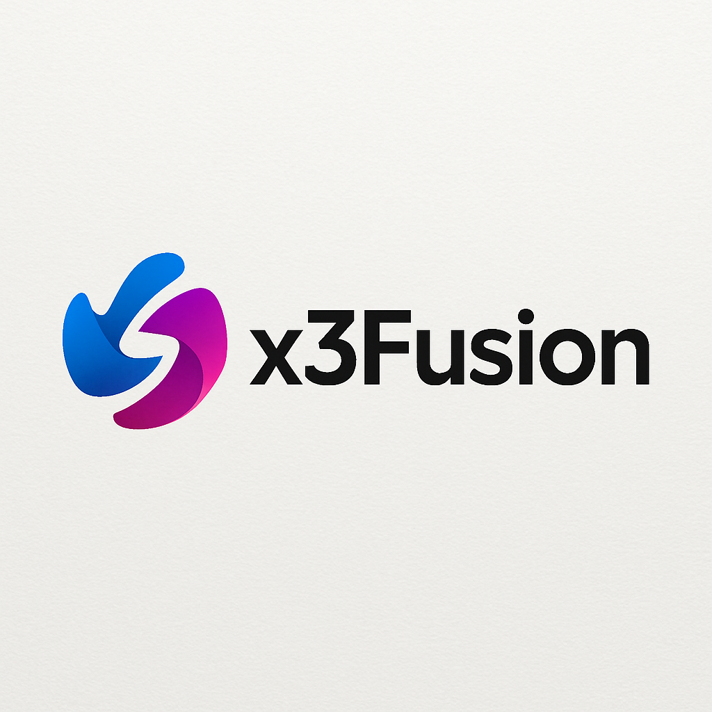
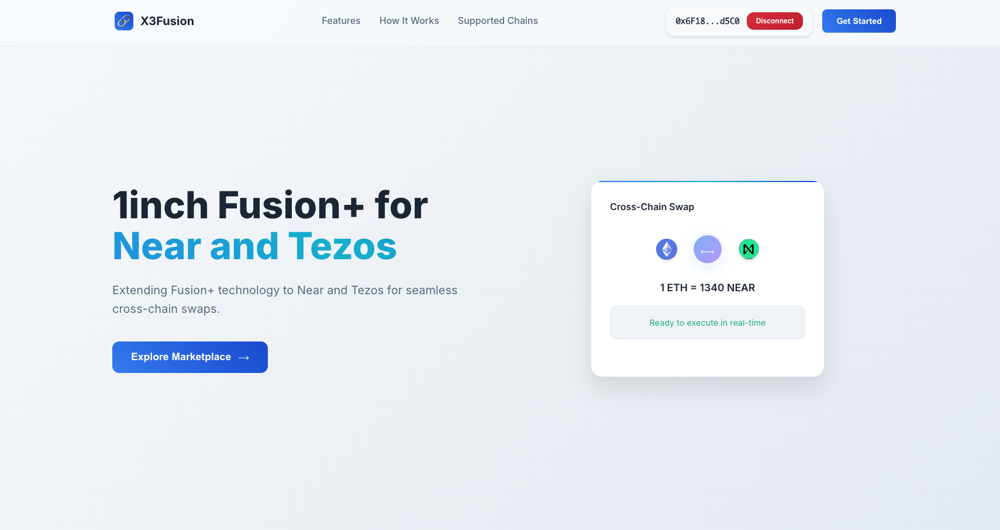
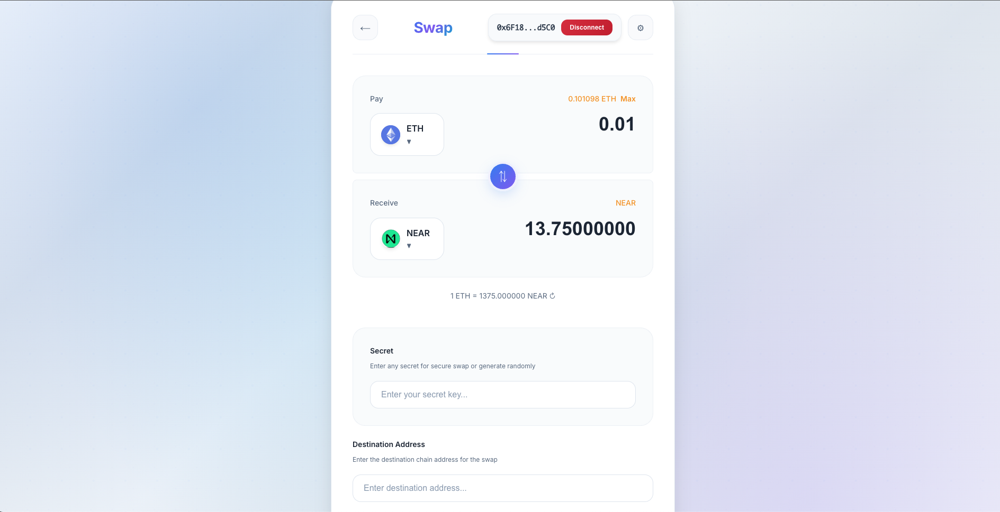
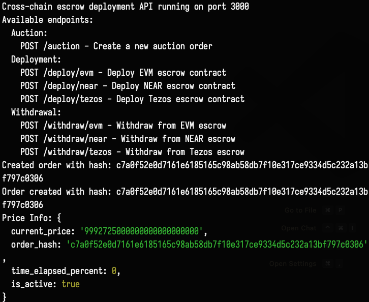

# X3Fusion


<center></center>

> X3Fusion is a cross-chain swap extension built on top of the 1inch Fusion+ framework, enabling seamless, trustless atomic swaps between Ethereum, NEAR, and Tezos. By combining on-chain HTLC logic, dynamic factory patterns, and an off-chain resolver API, X3Fusion abstracts away network-specific complexities and delivers a unified developer experience for building robust cross-chain applications.

## Features




- **Atomic Cross-Chain Swaps**: Trustless value transfers between ETH, NEAR, and Tezos using Hash Time-Locked Contracts (HTLCs).  
- **Dynamic Factory Pattern**: On-demand deployment of escrow contracts tailored to each swap’s parameters.  
- **Dutch Auction Support**: Custom price-curve logic to handle partial fills and efficient order matching on Tezos inspired from the Dutch Auction is LOP.  
- **Unified Resolver API**: Single RESTful interface to orchestrate auctions, deployments, and withdrawals across networks.  
- **1inch-Inspired EVM Escrows**: Proven Solidity contracts adapted to X3Fusion’s order schema for gas-efficient settlements.  
- **Rust & SmartPy Tooling**: Native NEAR Rust SDK integration and SmartPy-based Tezos contracts for rapid development and strong type safety.  


## How It Works




X3Fusion’s cross-chain swap logic is built on three specialized on-chain modules and a single off-chain Resolver API:

1. **Auction Phase**  
   - Create or fill a Dutch-auction order on the source chain (Ethereum or Tezos).  
   - Secret hashlocks and order parameters (amount, expiry, curve) are registered on-chain.

2. **Deployment Phase**  
   - Resolver calls the appropriate endpoint to deploy a new HTLC escrow on the destination chain:  
     - `POST /deploy/evm`  
     - `POST /deploy/near`  
     - `POST /deploy/tezos`

3. **Monitoring & Secret Reveal**  
   - Resolver listens for on-chain events signaling the secret preimage reveal.

4. **Withdrawal Phase**  
   - Once the secret is detected, the resolver finalizes the swap by invoking the correct withdrawal endpoint:  
     - `POST /withdraw/evm`  
     - `POST /withdraw/near`  
     - `POST /withdraw/tezos`

## Resolver API Endpoints




```plaintext
// Auction
POST /auction/start       – Create new Dutch-auction order
POST /auction/fillOrder   – Fill an existing auction order

// Deployment
POST /deploy/evm          – Deploy EVM escrow contract
POST /deploy/near         – Deploy NEAR escrow contract
POST /deploy/tezos        – Deploy Tezos escrow contract

// Withdrawal
POST /withdraw/evm        – Withdraw from EVM escrow
POST /withdraw/near       – Withdraw from NEAR escrow
POST /withdraw/tezos      – Withdraw from Tezos escrow

```

## Future Enhancements
-- ************Merkle Tree Secret Resolution**: Implement a Merkle-tree-of-secrets scheme to allow efficient, secure partial fills without exposing all preimages at once. Participants can prove knowledge of specific leaf preimages, preserving confidentiality and enabling granular withdrawals.

-- **Multi-Hop Swaps**: Extend resolver logic to coordinate atomic swaps across more than two chains in a single transaction flow.

-- **Enhanced Monitoring Dashboard**: Build a real-time UI to track orders, deployments, and settlements across all supported networks.